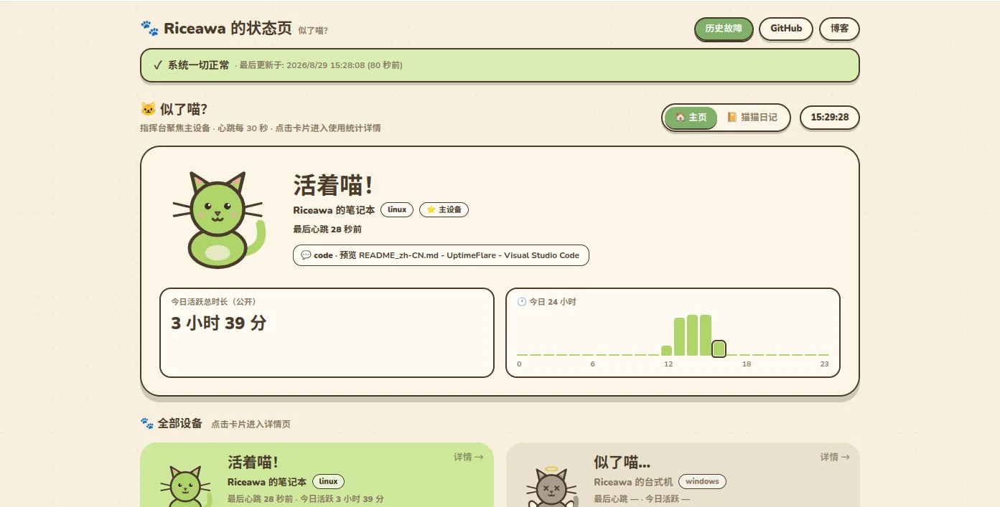
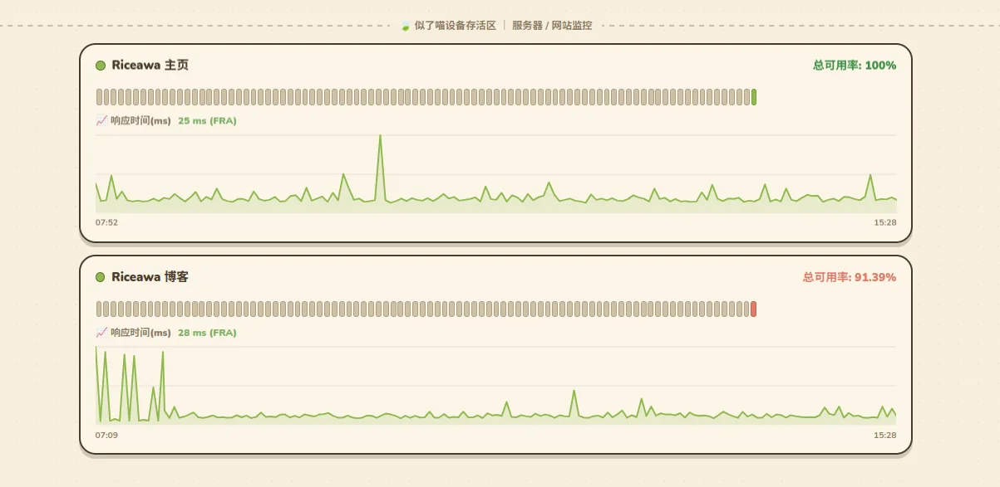

<div align="right">
  <a title="English" href="README.md"></a>
  <a title="简体中文" href="README_zh-CN.md"></a>
</div>

<div align="center">
  <a href="https://github.com/rice-awa/rualive">
    
  </a>

  <h1>rualive (Are you alive?)</h1>

  <p>A cozy, animal-island-style uptime and device-presence monitor built on Cloudflare.</p>

  <p>
    <a href="https://github.com/rice-awa/rualive/actions/workflows/deploy.yml"></a>
    
    
    
    
    <a href="LICENSE"></a>
  </p>
</div>

`rualive` is the reworked edition of [UptimeFlare](https://github.com/lyc8503/UptimeFlare). It keeps the original server and website monitoring workflow, then adds a heartbeat-driven device layer for answering one simple question: **are you alive?**

The project is designed for a personal, single-instance deployment. It runs the public status page on Cloudflare Pages, performs scheduled checks in a Cloudflare Worker, and stores monitoring data in Cloudflare D1.

## What it does

### Website and service monitoring

- HTTP, HTTPS, and TCP checks on a one-minute schedule.
- Custom methods, headers, request bodies, expected status codes, and keyword rules.
- Optional checks through a proxy or a specific Cloudflare location.
- Incident history, uptime counters, latency charts, and scheduled maintenance notices.
- Notifications through the existing universal webhook / Apprise-compatible workflow.
- Responsive light and dark status page with custom links, CNAME support, optional password protection, and JSON APIs.

### Device presence and screen-time tracking

The device agent sends a small heartbeat to `/api/heartbeat` every few seconds. A configured device can show:

- Active, idle, or offline status based on the last heartbeat.
- Last-seen time and a friendly device card in the animal-island UI.
- Current foreground application and window title.
- Today’s active time, hourly activity, application rankings, and 7/30-day trends when `usageTracking` is enabled.
- Private window details and usage charts protected by `USAGE_API_KEY`.
- Optional online/offline notifications through the configured webhook.
- Two client views: the device home cards and the compact diary feed.

The agent collects only the foreground window title, application identifier, and input-idle time. It does not take screenshots or record keystrokes.

## Visual style

The dashboard uses an **Animal Crossing-inspired, animal-island visual language**: a warm paper-like background, leaf-green status colors, rounded hand-drawn borders, friendly animal state illustrations, and compact data cards. The device area is the visual focus, while the website monitor cards share the same tokens for a consistent status page.

The device UI uses and references [animal-island-ui](https://github.com/guokaigdg/animal-island-ui), an open-source React component library for this visual direction.

## Screenshots

### Device presence and screen-time overview



### Website and service monitors



## Architecture

```text
                         GET /api/device/*
Browser  <──────────────────────────────────┐
                                           │
Agent ───── POST /api/heartbeat ───────> Cloudflare Pages
                                           │  Next.js / Edge API
Worker cron ───── HTTP/TCP checks ────────┤
                                           ▼
                                     Cloudflare D1
                                           │
                                           ▼
                                      Webhooks
```

- **Cloudflare Pages** renders the status page and hosts all HTTP API routes, including device heartbeats.
- **Cloudflare Worker** runs the scheduled monitor checks once per minute and sends status notifications.
- **Cloudflare D1** stores the compact monitor state plus device status, events, daily usage, and notification state.
- **Shared TypeScript modules** keep the Pages and Worker data model in sync.

## Quick start

### 1. Install dependencies

```bash
git clone https://github.com/rice-awa/rualive.git rualive
cd rualive
npm install
cd worker && npm install
cd ..
```

### 2. Configure monitors and devices

Edit [`uptime.config.ts`](uptime.config.ts):

- Set `pageConfig.title` to `rualive · Are you alive?`.
- Add website or service targets to `workerConfig.monitors`.
- Add each heartbeat device to `workerConfig.devices`.
- Set `usageTracking: true` only for devices whose activity should be stored.
- Keep `publicWindow: false` unless the current window may be shown to unauthenticated visitors.

Example device configuration:

```ts
devices: [
  {
    id: 'my-laptop',
    name: 'My laptop',
    os: 'Linux / KDE Plasma',
    offlineAfterSeconds: 90,
    usageTracking: true,
    publicWindow: false,
  },
],
```

Never put `AGENT_TOKEN`, `USAGE_API_KEY`, or any other secret in `uptime.config.ts`. This file is compiled into both the Worker and the public frontend bundle.

For local Pages development, put test values in the ignored `.dev.vars` file:

```dotenv
AGENT_TOKEN=replace-with-a-local-agent-token
USAGE_API_KEY=replace-with-a-local-usage-key
```

### 3. Run locally

```bash
# Create the local D1 schema
npx wrangler d1 execute uptimeflare_d1 --local --file=init.sql

# Build the Pages bundle and run the Cloudflare Pages runtime
npm run preview
```

For fast UI-only work, `npm run dev` starts the regular Next.js development server. D1-backed device and status-page behavior should be tested with `npm run preview`. To run the scheduled Worker locally:

```bash
cd worker
npm run dev
```

### 4. Deploy to Cloudflare

Pushing to `main` runs [`.github/workflows/deploy.yml`](.github/workflows/deploy.yml). Configure these GitHub Actions secrets before the first deployment:

| Secret | Required | Purpose |
|---|---:|---|
| `CLOUDFLARE_API_TOKEN` | Yes | Create and deploy Cloudflare resources |
| `CLOUDFLARE_ACCOUNT_ID` | No | Account ID; the workflow can discover it from the API token |
| `AGENT_TOKEN` | Yes | Authenticates device heartbeats |
| `USAGE_API_KEY` | Yes | Unlocks private device details and usage data |

The workflow builds the Worker and Pages app, creates or initializes the D1 database from [`init.sql`](init.sql), applies Terraform resources, and uploads the Pages deployment. For manual deployment options, see the [upstream deployment documentation](https://github.com/lyc8503/UptimeFlare/wiki).

## Device agent

The agent files live in [`agent/`](agent/). Both platforms use the same `agent.json` format:

```bash
cd agent
cp agent.json.example agent.json
# Edit endpoint, token, and device_id in agent.json.
```

`endpoint` is the site root, without `/api`. `device_id` must exactly match an entry in `workerConfig.devices`.

| Platform | Requirements | Installation |
|---|---|---|
| Linux | Python 3.8+, `requests`, KDE Plasma / Wayland; `kdotool` and `qdbus` are optional | `bash install-linux.sh` installs the user service and can configure `kdotool` |
| Windows | PowerShell 5.1+ | `powershell -NoProfile -ExecutionPolicy Bypass -File .\\agent\\agent.ps1 -Install` |

Windows has no third-party dependency. On Linux, if `kdotool` is unavailable, the agent falls back to heartbeat-only mode without window information. See the [agent guide](agent/README.md) for configuration, troubleshooting, and manual service setup.

Validate a Windows agent before installing its login task:

```powershell
powershell -NoProfile -ExecutionPolicy Bypass -File .\agent\agent.ps1 -Once
```

Validate a Linux agent without sending data:

```bash
python3 agent/agent.py --once --dry-run
```

## API overview

| Method and path | Authentication | Description |
|---|---|---|
| `POST /api/heartbeat` | `Authorization: Bearer <AGENT_TOKEN>` | Accepts a device heartbeat and optionally records usage data. Returns `204` on success. |
| `GET /api/device/status` | Public; `X-API-Key` is optional | Returns online/idle/offline status. A valid key also exposes private window fields. |
| `GET /api/device/usage?device_id=<id>&days=7` | `X-API-Key` required | Returns daily, hourly, and application usage data. |
| `GET /api/data` | Public | Returns the current monitor status as JSON. |
| `GET /api/state` | Public | Returns the compact state used by live page refreshes. |
| `GET /api/badge?id=<monitor-id>` | Public | Returns a badge payload for a monitor. |

Example heartbeat:

```bash
export RUALIVE_URL="https://your-status-page.example"
export AGENT_TOKEN="your-agent-token"

curl --request POST "$RUALIVE_URL/api/heartbeat" \
  --header "Authorization: Bearer $AGENT_TOKEN" \
  --header "Content-Type: application/json" \
  --data '{
    "device_id": "my-laptop",
    "device_name": "My laptop",
    "os": "linux",
    "os_ver": "KDE Plasma / Wayland",
    "title": "README.md - Visual Studio Code",
    "app": "code",
    "idle": 0
  }'
```

## Privacy and secrets

- `AGENT_TOKEN` is used only for accepting heartbeats.
- `USAGE_API_KEY` is required for usage charts and private window data.
- Without a valid usage key, `/api/device/status` hides `last_title` and `last_app`, unless that device explicitly sets `publicWindow: true`.
- The server timestamps heartbeats; client timestamps are not trusted for online status.
- `agent/agent.json` and `.dev.vars` are ignored by Git. Do not commit either file.

## Project layout

```text
pages/              Next.js status page and Edge API routes
components/         Monitor and device UI components
worker/src/         Scheduled Worker and shared D1 data layer
agent/              Linux and Windows heartbeat agents
init.sql            D1 schema
deploy.tf           Cloudflare Terraform resources
docs/               Product requirements, development plan, and preview assets
```

## Development checks

The project currently has no automated unit-test suite. Use the following checks before opening a change:

```bash
npm run lint
npm run build
```

For the device feature details and implementation decisions, see [`docs/PRD.md`](docs/PRD.md) and [`docs/DEV_PLAN.md`](docs/DEV_PLAN.md).

## Credits and license

rualive is built on the work of both the active upstream fork and the original UptimeFlare project. Thank you to their maintainers and contributors for the Cloudflare monitoring foundation.

- **Animal-island UI library and visual reference:** [guokaigdg/animal-island-ui](https://github.com/guokaigdg/animal-island-ui)

<div align="center">
  <a href="https://github.com/afoim/UptimeFlare">
    
  </a>
  <a href="https://github.com/lyc8503/UptimeFlare">
    
  </a>
</div>

- **Fork upstream:** [afoim/UptimeFlare](https://github.com/afoim/UptimeFlare)
- **Original project:** [lyc8503/UptimeFlare](https://github.com/lyc8503/UptimeFlare)

The project is released under the [Apache License 2.0](LICENSE).
